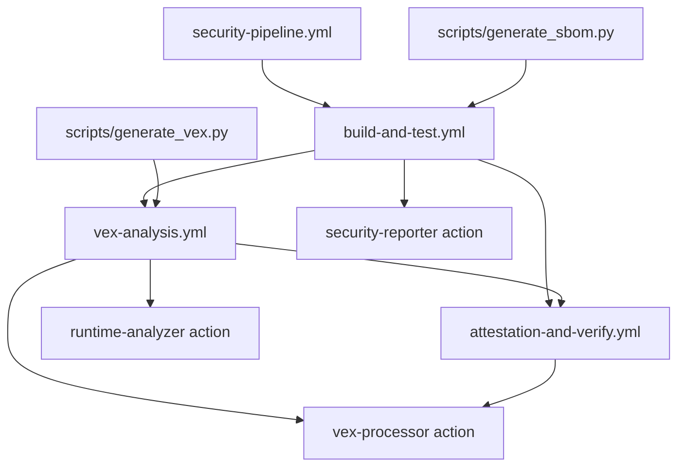

# 🛡️ SLSA Level 3 Workflow Architecture

## 📁 File Structure
```
.github/
├── workflows/
│   ├── security-pipeline.yml           # 🎯 Main orchestrator (50 lines)
│   ├── build-and-test.yml             # 🏗️ Build + basic security (400 lines)
│   ├── vex-analysis.yml               # 🔍 VEX generation (500 lines)
│   └── attestation-and-verify.yml     # 🔒 Final attestation (300 lines)
└── actions/
    ├── security-reporter/              # 📊 Beautiful security reporting
    ├── vex-processor/                  # 🛡️ VEX processing & consolidation
    └── runtime-analyzer/               # 🚀 Kubescape + Kind setup
```

## 🔄 Workflow Orchestration

### 1. **security-pipeline.yml** (Main Orchestrator)
- Triggers the 3 sub-workflows in sequence
- Handles overall pipeline status
- Generates final summary
- ~50 lines of pure orchestration

### 2. **build-and-test.yml** 
- Testing (pytest, linters, security checks)
- SBOM generation (`scripts/generate_sbom.py`)
- Container build + signing
- Basic Trivy scanning
- ~400 lines

### 3. **vex-analysis.yml**
- Build-time VEX generation (`scripts/generate_vex.py`)
- Runtime VEX with Kubescape
- VEX document processing
- Uses `vex-processor` and `runtime-analyzer` actions
- ~500 lines

### 4. **attestation-and-verify.yml**
- Final VEX consolidation
- SLSA provenance generation
- Container attestation
- Verification phase
- ~300 lines

## 🧩 Composite Actions

### **security-reporter** Action
**Purpose**: Centralize all that beautiful markdown reporting
- Trivy result processing & visualization
- Test result summaries
- Vulnerability charts and progress bars
- Phase completion banners

### **vex-processor** Action  
**Purpose**: Handle VEX document operations
- VEX validation and merging
- VEX filtering application
- VEX attestation creation
- Consolidation logic

### **runtime-analyzer** Action
**Purpose**: Kubescape runtime analysis setup
- Kind cluster creation
- Kubescape operator installation
- Application deployment
- Runtime load generation

## 🎯 Benefits

### ✅ **Maintainability**
- Each workflow has single responsibility
- Easier to debug specific phases
- Cleaner git history for changes

### ✅ **Reusability** 
- Composite actions work across projects
- Sub-workflows can be called independently
- Easy to mix-and-match security features

### ✅ **Parallel Execution**
- VEX analysis can start as soon as build completes
- Independent workflows can run in parallel for different triggers

### ✅ **Testing & Development**
- Test individual workflows in isolation
- Faster iteration on specific components
- Easier to add new security features

## 🔄 Data Flow



## 📋 Artifact Flow

### Artifacts Generated:
1. **build-and-test.yml**:
   - `sbom-{sha}`
   - `baseline-scan-{sha}`
   - `test-results-{sha}`

2. **vex-analysis.yml**:
   - `build-time-vex-{sha}`
   - `runtime-vex-{sha}`

3. **attestation-and-verify.yml**:
   - `final-consolidated-vex-{sha}`
   - `slsa-provenance-{sha}`

### Artifact Dependencies:
- VEX analysis consumes build artifacts
- Attestation consumes all VEX artifacts
- Clean handoff between workflows

## 🎚️ Configuration Strategy

### Shared Environment Variables:
```yaml
env:
  REGISTRY: ghcr.io
  IMAGE_NAME: ${{ github.repository }}
  VEX_ENABLED: true
  SLSA_LEVEL: 3
```

### Reusable Inputs:
- Image digest (passed between workflows)
- Security scan results
- VEX document references
- Attestation metadata
