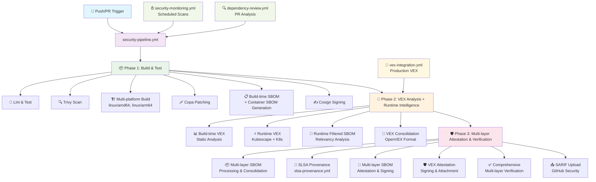

# 🛡️ FeelGood API – SLSA Level 3+ Enhanced Supply Chain Security Showcase

**A production-ready demonstration of next-generation DevSecOps and supply chain security.**

While the API itself is a simple motivational phrase service, this repository showcases a **complete SLSA Level 3+ Enhanced implementation** with multi-layer SBOM generation, build-time + runtime vulnerability analysis, comprehensive attestation, and automated security verification.

## 🚀 **Revolutionary Multi-Layer SBOM Strategy**

This project implements the industry's most comprehensive SBOM approach with **4 distinct transparency layers**:

- **🏗️ Build-time SBOMs**: Application dependencies as declared by package managers
- **📦 Container SBOMs**: Complete inventory of deployable container contents  
- **🎯 Runtime Filtered SBOMs**: Kubescape relevancy analysis identifying only active components
- **🔄 Consolidated SBOMs**: Unified view with comprehensive SLSA metadata for complete transparency

---

## 🎯 Why This Project Matters

This repo is not just about code – it’s about **trust**. Every artifact, dependency, and workflow is:
- **🔍 Multi-layer Audited** (build-time + runtime + container)
- **✍️ Cryptographically Signed** (all SBOM layers + VEX + provenance)
- **📜 Comprehensively Attested** (4 SBOM types + enhanced metadata)
- **🎯 Runtime-Relevant Tracked** (Kubescape filtered components)
- **✅ Automatically Verified** (end-to-end validation)

with cutting-edge industry standards and **SLSA Level 3+ Enhanced** compliance.

---

## 🔒 SLSA Level 3+ Enhanced Compliance
- **🏗️ Isolated, reproducible builds** using GitHub Actions and multi-stage Docker builds
- **📜 Enhanced provenance generation** with [SLSA](https://slsa.dev/) GitHub generator workflows + multi-layer metadata
- **✍️ Multi-layer container signing** and comprehensive attestation with [Cosign](https://github.com/sigstore/cosign)
- **🎯 Runtime-aware verification** of signatures, provenance, and multi-layer SBOMs in CI
- **🔄 Automated SBOM consolidation** across all supply chain layers

**Relevant files:**
- `.github/workflows/security-pipeline.yml` (main orchestrator)
- `.github/workflows/build-and-test.yml` 
- `.github/workflows/attestation-and-verify.yml`
- `.github/workflows/slsa-provenance.yml`
- `scripts/verify_attestations.py`
- `Dockerfile`

---

## 📦 Revolutionary Multi-Layer SBOM Strategy

### 🚀 **Industry-First 4-Layer SBOM Implementation**

**🏗️ Build-time SBOMs**
- Application dependencies as declared by package managers (pip, poetry, etc.)
- Enhanced with SLSA metadata, GitHub Actions context, and git commit info
- CycloneDX format with comprehensive build provenance

**📦 Container SBOMs** 
- Complete inventory of everything inside the deployable container image
- Generated with Syft for comprehensive OS packages, binaries, and libraries
- Full container transparency beyond application dependencies

**🎯 Runtime Filtered SBOMs** *(Revolutionary)*
- **Kubescape relevancy analysis** identifying only components that are actually active at runtime
- Dynamic component tracking during real application execution
- Reduces noise by focusing on runtime-relevant vulnerabilities

**🔄 Consolidated Multi-Layer SBOMs**
- Unified view combining all layers with comprehensive SLSA metadata
- Complete supply chain transparency from source to runtime
- Enhanced attestation with multi-layer component tracking

### ✅ **Comprehensive SBOM Attestation**
All four SBOM types are cryptographically signed and attached to container images, providing unprecedented supply chain visibility.

**Relevant files:**
- `.github/actions/sbom-processor/` (multi-layer SBOM processing)
- `scripts/generate_sbom.py` (enhanced build-time generation)
- `scripts/verify_attestations.py` (multi-layer verification)
- `.github/workflows/build-and-test.yml`, `.github/workflows/vex-analysis.yml`, `.github/workflows/attestation-and-verify.yml`

---

## 🦺 Enhanced VEX (Vulnerability Exploitability eXchange) + Runtime Intelligence
- **🏗️ Build-time VEX**: Static vulnerability analysis with Trivy, output as OpenVEX
- **⚡ Runtime VEX**: Dynamic analysis using [Kubescape](https://github.com/kubescape/kubescape) in ephemeral Kubernetes clusters
- **🎯 Runtime Filtered SBOM Integration**: VEX analysis correlates with Kubescape relevancy data for precise risk assessment
- **🔄 VEX consolidation**: All VEX docs are validated, merged, and attached to images as signed attestations
- **🏭 Production VEX**: Real-world VEX from production can be added and automatically integrated
- **📊 Multi-layer correlation**: VEX statements mapped to specific SBOM layers for enhanced context

**Relevant files:**
- `scripts/generate_vex.py`, `.vex/`, `.vex/README.md`
- `.github/workflows/vex-analysis.yml`, `.github/workflows/vex-integration.yml`
- `.vex/production/example.vex.json`, `.vex/validate-vex.sh`

---

## 🔍 Automated Security Scanning & Lock Management
- **Dependency audits** with pip-audit (pre/post lock generation)
- **Container scans** with Trivy
- **Lock file generation** with integrity and hash verification
- **Automated lock refresh, update, and verification**

**Relevant files:**
- `Makefile` (see `refresh-locks`, `update-deps` targets)
- `.github/workflows/dependency-review.yml`
- `.github/workflows/security-monitoring.yml`

---

## 🛠️ Makefile Commands

All security, compliance, and build tasks are managed via the Makefile. Here are the available commands:

### 📦 Dependencies
- `make install` – Install dependencies (via Poetry)
- `make lock` – Generate all lock files (`requirements.txt`, `requirements-lock.txt`, `requirements-dev.txt`)
- `make refresh-locks` – Clear caches and regenerate all lock files
- `make update-deps` – Update dependencies and regenerate locks
- `make verify-lock` – Verify lock file integrity

### 🧪 Testing & Quality
- `make test` – Run tests with pytest
- `make lint` – Run code formatters and type checks (black, mypy)

### 🔒 Security
- `make security-check` – Run basic security checks (pip-audit)
- `make security-full` – Run the full security pipeline: audit, multi-layer SBOM, VEX, comprehensive verification
- `make trivy-scan` – Run Trivy vulnerability scan (filesystem)
- `make verify-local IMAGE=...` – Verify signatures, provenance, and multi-layer SBOM attestations locally for a given image

### 📋 Documentation & Compliance
- `make sbom` – Generate enhanced build-time SBOM with SLSA metadata
- `make vex` – Generate VEX document (uses Trivy scan and multi-layer SBOM if available)
- `make slsa-check` – Check SLSA Level 3+ compliance (runs multi-layer SBOM/VEX generation and prints enhanced compliance status)

### 🐳 Docker
- `make build` – Build the Docker image
- `make run` – Run the Docker container (port 8000)

### 🧹 Utilities
- `make clean` – Clean up cache files and Python bytecode

---

## 🚦 Quick Start
```zsh
# Install dependencies
make install

# Generate and verify lock files
make lock
make verify-lock

# Run all security checks and generate SBOM/VEX
make security-full

# Build and run the container
make build
make run
```

---

## 🌐 API Endpoints

The Feel Good API provides the following endpoints:

- **`GET /`** - Root endpoint with API information
- **`GET /health`** - Health check with build information and SLSA metadata
- **`GET /phrase?category={category}`** - Get a random motivational phrase (optional category filter)
- **`GET /phrases/categories`** - List all available phrase categories
- **`GET /security`** - Enhanced security and multi-layer supply chain information overview
- **`GET /security/sbom`** - Build-time Software Bill of Materials (SBOM) in CycloneDX format with SLSA metadata
- **`GET /security/vex`** - Consolidated Vulnerability Exploitability eXchange (VEX) document with runtime intelligence
- **`GET /security/provenance`** - SLSA Level 3+ provenance information with multi-layer attestation details

**Interactive API docs:** Available at `/docs` when running the server.

---

## 🗂️ VEX Document Management
- `.vex/production/`: VEX documents from production runtime
  - `example.vex.json`: Example production VEX document
- `.vex/README.md`: Naming conventions, update instructions, OpenVEX format
- `.vex/validate-vex.sh`: Script to validate VEX documents with `vexctl`
- `.vex/add-production-vex.sh`: Helper script for adding new production VEX documents
- VEX docs are validated before commit and integrated into the CI/CD pipeline

---

## 🏗️ CI/CD Pipeline Overview

**Main Security Pipeline** (`security-pipeline.yml`) orchestrates a 3-phase SLSA Level 3+ Enhanced process with revolutionary multi-layer SBOM strategy:



**Phase 1: Build & Test** (`build-and-test.yml`)
- Lint, test, vulnerability scanning with Trivy
- Multi-platform container builds (linux/amd64, linux/arm64)  
- Automatic patching with Copa (project-copacetic)
- **🏗️ Build-time SBOM generation** with SLSA metadata (application dependencies)
- **📦 Container SBOM generation** with Syft (full image contents)
- Container signing with Cosign

**Phase 2: VEX Analysis + Runtime Intelligence** (`vex-analysis.yml`)
- **🏗️ Build-time VEX**: Static analysis from container scans
- **⚡ Runtime VEX**: Dynamic analysis using Kubescape in ephemeral K8s clusters
- **🎯 Runtime Filtered SBOM extraction**: Kubescape relevancy analysis for runtime-active components
- **🔄 VEX consolidation** and OpenVEX format compliance

**Phase 3: Multi-layer Attestation & Verification** (`attestation-and-verify.yml`)
- **📦 Multi-layer SBOM processing**: Consolidation of all 4 SBOM types with enhanced metadata
- **📜 SLSA Level 3+ provenance generation** (`slsa-provenance.yml`)
- **🔐 Multi-layer SBOM attestations**: Cryptographic signing of all SBOM layers
- **🛡️ VEX attestation** signing and attachment
- **✅ Comprehensive multi-layer verification** of all signatures and attestations
- **📤 SARIF upload** to GitHub Security tab

**Additional Workflows:**
- **Security Monitoring** (`security-monitoring.yml`): Scheduled scans
- **Dependency Review** (`dependency-review.yml`): PR dependency analysis
- **VEX Integration** (`vex-integration.yml`): Production VEX processing

---

## 🌈 Why This Revolutionary Approach Matters
- **Transparency**: Know exactly what’s in your software and how it was built
- **Trust**: Every artifact is signed, attested, and verified
- **Resilience**: Both static and runtime vulnerabilities are tracked and mitigated
- **Modern DevSecOps**: Real-world SLSA, SBOM, and VEX integration

### 🚀 **Revolutionary Multi-Layer SBOM Benefits:**
- **🔍 Complete Supply Chain Visibility**: Track every component from source dependencies to runtime execution
- **🎯 Runtime-Relevant Security**: Focus on components that actually matter during execution
- **📦 Comprehensive Attestation**: All 4 SBOM layers cryptographically signed and verifiable
- **⚡ Enhanced Risk Assessment**: VEX documents precisely correlated with runtime behavior
- **🔄 Unified Transparency**: Single consolidated view across build-time, container, and runtime layers

---

## 🔧 Multi-Layer SBOM Troubleshooting

If you encounter issues with the multi-layer SBOM implementation, here's a quick troubleshooting guide:

### Common Issues and Solutions

**1. "Artifact not found" errors:**
- ✅ Check artifact naming consistency in workflows
- ✅ Verify all workflows are using artifact names, not IDs
- ✅ Ensure VEX analysis completes before attestation phase

**2. "Missing filtered SBOM" warnings:**
- ✅ Verify Kubescape operator is properly installed with `kubevuln.config.storeFilteredSbom=true`
- ✅ Check that nodeAgent pods are running in the kubescape namespace
- ✅ Ensure learning period (`vex-analysis-time`) is sufficient for relevancy analysis
- ✅ Verify runtime application deployment is generating traffic for analysis

**3. SBOM processor failures:**
- ✅ Check that build-time SBOM artifact exists and is valid JSON
- ✅ Ensure container image reference is accessible
- ✅ Verify all required tools (Syft, cyclonedx-cli) are properly installed

**4. Kubescape CRD issues:**
- ✅ Verify filtered SBOM CRDs are installed: `kubectl get crd | grep sbom`
- ✅ Check for resources: `kubectl get sbomsyftfiltereds -n kubescape`
- ✅ Monitor Kubescape logs: `kubectl logs -n kubescape -l app.kubernetes.io/name=kubevuln`

**5. External cluster configuration:**
- ✅ Ensure KUBECONFIG secret is properly base64-encoded
- ✅ Verify cluster has sufficient resources and network access
- ✅ Check that Kubescape operator can be installed/upgraded

**Debug Commands:**
```bash
# Check all SBOM artifacts in a workflow run
gh run view <run-id> --json artifacts

# Verify Kubescape configuration
helm get values kubescape -n kubescape | grep -A 10 kubevuln

# Monitor filtered SBOM generation
kubectl get sbomsyftfiltereds -n kubescape --watch
```

---

## 📚 Learn More
- [SLSA Framework](https://slsa.dev/)
- [OpenVEX](https://openvex.dev/)
- [Sigstore/Cosign](https://docs.sigstore.dev/cosign/overview/)
- [CycloneDX SBOM](https://cyclonedx.org/)
- [Kubescape](https://github.com/kubescape/kubescape)

---

> **FeelGood API** – Where even Hello World achieves SLSA Level 3+ Enhanced with revolutionary multi-layer SBOM transparency. 🚀🛡️
