# 🛡️ FeelGood API – SLSA Level 3 Supply Chain Security Showcase

**A production-ready demonstration of modern DevSecOps and supply chain security.**

While the API itself is a simple motivational phrase service, this repository showcases a **complete SLSA Level 3 implementation** with build-time + runtime vulnerability analysis, comprehensive attestation, and automated security verification.

---

## 🎯 Why This Project Matters

This repo is not just about code – it’s about **trust**. Every artifact, dependency, and workflow is:
- **Audited**
- **Signed**
- **Attested**
- **Tracked**
- **Verified**

with industry best practices and open standards.

---

## 🔒 SLSA Level 3 Compliance
- **Isolated, reproducible builds** using GitHub Actions and multi-stage Docker builds
- **Provenance generation** with [SLSA](https://slsa.dev/) GitHub generator workflows
- **Container signing** and attestation with [Cosign](https://github.com/sigstore/cosign)
- **Automated verification** of signatures and provenance in CI

**Relevant files:**
- `.github/workflows/security-pipeline.yml` (main orchestrator)
- `.github/workflows/build-and-test.yml` 
- `.github/workflows/attestation-and-verify.yml`
- `.github/workflows/slsa-provenance.yml`
- `scripts/verify_attestations.py`
- `Dockerfile`

---

## 📦 SBOM (Software Bill of Materials)
- **Automated SBOM generation** at build time (CycloneDX format)
- **Enhanced SBOM** includes SLSA metadata, GitHub Actions context, and git commit info
- **SBOM hash verification** for tamper detection
- **Dependency SBOM** for lock file transparency

**Relevant files:**
- `scripts/generate_sbom.py`
- `sbom.json`
- `.github/workflows/build-and-test.yml`

---

## 🦺 VEX (Vulnerability Exploitability eXchange)
- **Build-time VEX**: Static vulnerability analysis with Trivy, output as OpenVEX
- **Runtime VEX**: Dynamic analysis using [Kubescape](https://github.com/kubescape/kubescape) in ephemeral Kubernetes clusters
- **VEX consolidation**: All VEX docs are validated, merged, and attached to images as signed attestations
- **Production VEX**: Real-world VEX from production can be added and automatically integrated

**Relevant files:**
- `scripts/generate_vex.py`, `.vex/`, `.vex/README.md`
- `.github/workflows/vex-analysis.yml`, `.github/workflows/vex-integration.yml`
- `.vex/production/example.vex.json`, `.vex/validate-vex.sh`

---

## 🔍 Automated Security Scanning & Lock Management
- **Dependency audits** with pip-audit (pre/post lock generation)
- **Container scans** with Trivy
- **Lock file generation** with integrity and hash verification
- **Automated lock refresh, update, and verification**

**Relevant files:**
- `Makefile` (see `refresh-locks`, `update-deps` targets)
- `.github/workflows/dependency-review.yml`
- `.github/workflows/security-monitoring.yml`

---

## 🛠️ Makefile Commands

All security, compliance, and build tasks are managed via the Makefile. Here are the available commands:

### 📦 Dependencies
- `make install` – Install dependencies (via Poetry)
- `make lock` – Generate all lock files (`requirements.txt`, `requirements-lock.txt`, `requirements-dev.txt`)
- `make refresh-locks` – Clear caches and regenerate all lock files
- `make update-deps` – Update dependencies and regenerate locks
- `make verify-lock` – Verify lock file integrity

### 🧪 Testing & Quality
- `make test` – Run tests with pytest
- `make lint` – Run code formatters and type checks (black, mypy)

### 🔒 Security
- `make security-check` – Run basic security checks (pip-audit)
- `make security-full` – Run the full security pipeline: audit, SBOM, VEX, verification
- `make trivy-scan` – Run Trivy vulnerability scan (filesystem)
- `make verify-local IMAGE=...` – Verify signatures and attestations locally for a given image

### 📋 Documentation & Compliance
- `make sbom` – Generate SBOM with build metadata
- `make vex` – Generate VEX document (uses Trivy scan and SBOM if available)
- `make slsa-check` – Check SLSA Level 3 compliance (runs SBOM/VEX generation and prints compliance status)

### 🐳 Docker
- `make build` – Build the Docker image
- `make run` – Run the Docker container (port 8000)

### 🧹 Utilities
- `make clean` – Clean up cache files and Python bytecode

---

## 🚦 Quick Start
```zsh
# Install dependencies
make install

# Generate and verify lock files
make lock
make verify-lock

# Run all security checks and generate SBOM/VEX
make security-full

# Build and run the container
make build
make run
```

---

## 🌐 API Endpoints

The Feel Good API provides the following endpoints:

- **`GET /`** - Root endpoint with API information
- **`GET /health`** - Health check with build information and SLSA metadata
- **`GET /phrase?category={category}`** - Get a random motivational phrase (optional category filter)
- **`GET /phrases/categories`** - List all available phrase categories
- **`GET /security`** - Security and supply chain information overview
- **`GET /security/sbom`** - Software Bill of Materials (SBOM) in CycloneDX format
- **`GET /security/vex`** - Vulnerability Exploitability eXchange (VEX) document
- **`GET /security/provenance`** - SLSA provenance information

**Interactive API docs:** Available at `/docs` when running the server.

---

## 🗂️ VEX Document Management
- `.vex/production/`: VEX documents from production runtime
  - `example.vex.json`: Example production VEX document
- `.vex/README.md`: Naming conventions, update instructions, OpenVEX format
- `.vex/validate-vex.sh`: Script to validate VEX documents with `vexctl`
- `.vex/add-production-vex.sh`: Helper script for adding new production VEX documents
- VEX docs are validated before commit and integrated into the CI/CD pipeline

---

## 🏗️ CI/CD Pipeline Overview

**Main Security Pipeline** (`security-pipeline.yml`) orchestrates a 3-phase SLSA Level 3 process:

```mermaid
flowchart TD
    A[🚀 Push/PR Trigger] --> B[security-pipeline.yml]
    
    B --> C[📦 Phase 1: Build & Test]
    C --> C1[🧪 Lint & Test]
    C --> C2[🔍 Trivy Scan]
    C --> C3[🏗️ Multi-platform Build<br/>linux/amd64, linux/arm64]
    C --> C4[🩹 Copa Patching]
    C --> C5[📋 Enhanced SBOM<br/>+ SLSA metadata]
    C --> C6[✍️ Cosign Signing]
    
    C --> D[🔬 Phase 2: VEX Analysis]
    D --> D1[📊 Build-time VEX<br/>Static Analysis]
    D --> D2[⚡ Runtime VEX<br/>Kubescape + K8s]
    D --> D3[🔄 VEX Consolidation<br/>OpenVEX Format]
    
    D --> E[🛡️ Phase 3: Attestation & Verification]
    E --> E1[📜 SLSA Provenance<br/>slsa-provenance.yml]
    E --> E2[🔐 VEX Attestation<br/>Signing & Attachment]
    E --> E3[✅ Comprehensive<br/>Verification]
    E --> E4[📤 SARIF Upload<br/>GitHub Security]
    
    F[⏰ security-monitoring.yml<br/>Scheduled Scans] --> B
    G[🔍 dependency-review.yml<br/>PR Analysis] --> B
    H[📝 vex-integration.yml<br/>Production VEX] --> D
    
    style A fill:#e1f5fe
    style B fill:#f3e5f5
    style C fill:#e8f5e8
    style D fill:#fff3e0
    style E fill:#fce4ec
    style F fill:#f1f8e9
    style G fill:#f1f8e9
    style H fill:#fff8e1
```



**Phase 1: Build & Test** (`build-and-test.yml`)
- Lint, test, vulnerability scanning with Trivy
- Multi-platform container builds (linux/amd64, linux/arm64)  
- Automatic patching with Copa (project-copacetic)
- Enhanced SBOM generation with SLSA metadata
- Container signing with Cosign

**Phase 2: VEX Analysis** (`vex-analysis.yml`)
- **Build-time VEX**: Static analysis from container scans
- **Runtime VEX**: Dynamic analysis using Kubescape in ephemeral K8s clusters
- VEX consolidation and OpenVEX format compliance

**Phase 3: Attestation & Verification** (`attestation-and-verify.yml`)
- SLSA Level 3 provenance generation (`slsa-provenance.yml`)
- VEX attestation signing and attachment
- Comprehensive verification of all signatures and attestations
- SARIF upload to GitHub Security tab

**Additional Workflows:**
- **Security Monitoring** (`security-monitoring.yml`): Scheduled scans
- **Dependency Review** (`dependency-review.yml`): PR dependency analysis
- **VEX Integration** (`vex-integration.yml`): Production VEX processing

---

## 🌈 Why This Matters
- **Transparency**: Know exactly what’s in your software and how it was built
- **Trust**: Every artifact is signed, attested, and verified
- **Resilience**: Both static and runtime vulnerabilities are tracked and mitigated
- **Modern DevSecOps**: Real-world SLSA, SBOM, and VEX integration

---

## 📚 Learn More
- [SLSA Framework](https://slsa.dev/)
- [OpenVEX](https://openvex.dev/)
- [Sigstore/Cosign](https://docs.sigstore.dev/cosign/overview/)
- [CycloneDX SBOM](https://cyclonedx.org/)
- [Kubescape](https://github.com/kubescape/kubescape)

---

> **FeelGood API** – Where even Hello World is built like a fortress. 🏰
